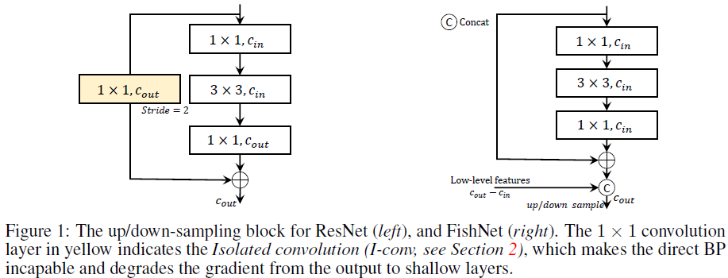
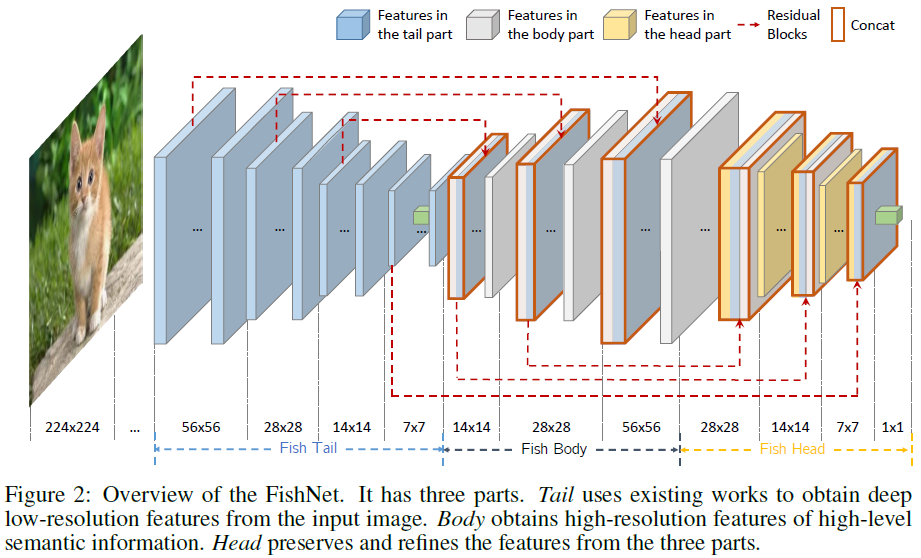
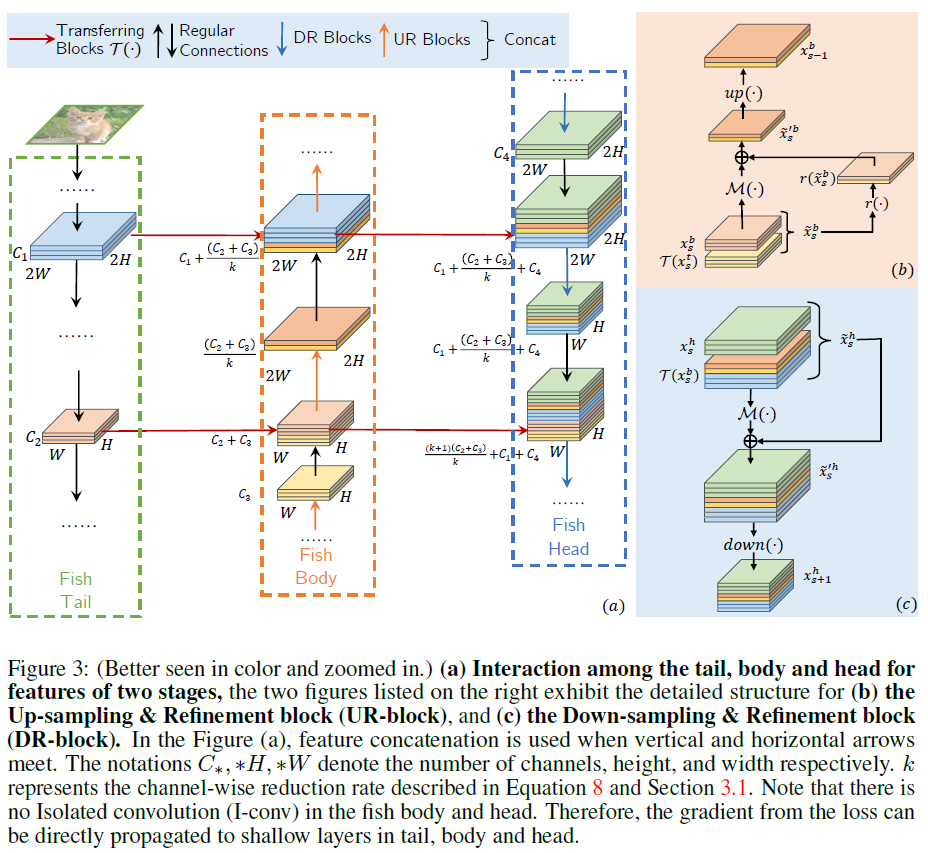
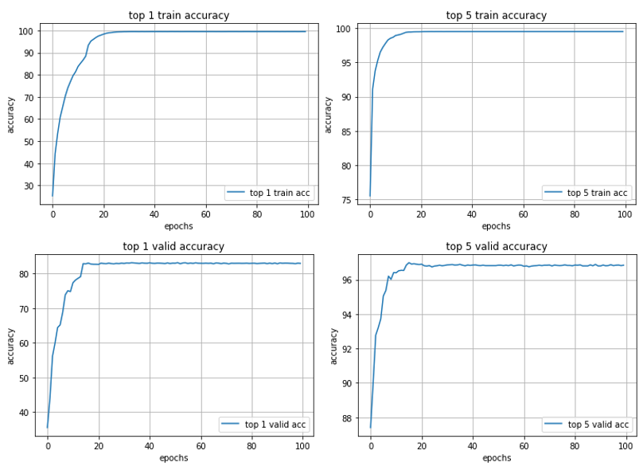

# fishNet_JungyuKo

# FishNet Summary
## Task
* detection, Segmentation과 관련된 task에서 image의 feature vector를 얻기위한 backbone network가 존재함.
* pixel-level, region-level과 관련된 task에서 image의 feature vector를 얻기위한 backbone network의 부재로부터 해당 논문은 시작됨.

**Why FishNet**
* 흔히 image feature vector를 얻기 위한 backbone network는 [ResNet](https://www.cv-foundation.org/openaccess/content_cvpr_2016/papers/He_Deep_Residual_Learning_CVPR_2016_paper.pdf)을 사용함.
* FishNet을 사용해야하는 이유가 있을까?
    1. 일반적인 CNN 구조의 network와는 달리 마지막 task에 모든 해상도의 정보가 보존됨
    2. 이전 task들에선 deep layer에서 shallow layer로 정보가 전파될 때, 정보가 손실이 되지만, 
    <br/>FishNet은 이러한 정보의 손실이 없음
    3. 일반적으로 backbone network로 사용되는 ResNet, [DenseNet](https://arxiv.org/abs/1608.06993)에 비해 더 적은 파라미터를 사용하여 더 좋은 성능을 얻음

**ResNet vs FishNet**


## FrameWork
* FishNet은 크게 아래 이미지와 같이 3가지 구조로 나뉨
    

**Tail**
* 기존 ResNet처럼 layer가 깊어질수록 resolution이 점점 작아지는 형태를 띄는 CNN 구조

**Body**
* tail과 body의 feature를 정제하기 위한 여러 Up-sampling과 Refinement block (UR-block)들이 존재함

**Head**
* tail, body, head의 feature를 보존하고 정제하기 위한 여러 Down-sampling과 Refinement block(DR-block)들이 존재함

**More Detail**

* Fig 3-(a)를 보면, Fish Tail은 Residual Network로 볼 수 있고, <br/>
여러 residual block을 거치면서 Fish Body로 전달되는 것을 알 수 있음
* Fig 3-(a)의 Fish Body는 Fish Tail의 feature와 Fish Body의 이전 stage의 feature를 연결하여 정보를 보존함
* Fig 3-(a)의 Fish Head는 Fish Tail과 Fish Body의 이전 stage의 모든 feature를 연결하여 보존함
* Fig 3-(b)는 UR-block의 동작원리를 설명함
* Fig 3-(c)는 DR-block의 동작원리를 설명함 

# FishNet Implement
* Task: Image Classification
* Dataset: CIFAR-10 Dataset
* metric: top-1, top-5 Accuracy

## Directory Explain
```bash
FishNet
├── .gitignore
├── README.md
├── train.py    # training model
├── eval.py     # test model
├── utils.py    # load dataloader, initialize, save model ...
│
├── data/
│   ├── download_data.py        # prepare CiFar-10 Dataset
│   ├── train_img2labels.json   # train images & labels (40000)
│   ├── valid_img2labels.json   # valid images & labels (10000)
│   └── test_img2labels.json    # test images & labels (10000)
│  
├── dataloader/
│   └── datloader.py    # dataloader (images,labels)
│
└── models/
    ├── __init__.py     # init
    ├── blocks.py       # Residual, UR, DR block
    └── fishnet.py      # FishNet network

```


## Dataset
* [CIFAR Dataset](https://www.cs.toronto.edu/~kriz/cifar.html)에서 CIFAR-10 Dataset 사용
* Train Data로 50000장의 Image, Test Data로 10000장의 Image로 구성
* 좋은 성능의 모델을 얻기 위해 Train Data를 (40000/10000)장의 이미지로 train/valid data 분류
* (Train/Valid/Test) - (40000/10000/10000)장의 Image, GT-Label로 분류

## Hyper-Parameters
* batch size: 256
* epochs: 100
* Optimizer: SGD
* learning rate: 0.1
* weight decay: 0.0001
* momentum: 0.9
* lr_scheduler: 30 epoch마다 10배 감소
* GPU: RTX 2080Ti (학습시간: 1시간)

## Result
* Train/Valid Dataset에 대한 top1, top5 정확도 측정 결과
    

* 각 Dataset 별 정확도 결과

    |       | top-1 acc | top-5 acc |
    |-------|-----------|-----------|
    | train | 98.3131%  | 99.5223%  |
    | valid | 83.0967%  | 96.7383%  |
    | test  | 85.0600%  | 99.1800%  |


## More Idea
1. Tail - Body - Head로 이어지는 구조에 2개의 Module 추가
    * Update 예정

<!-- 2. Tail -> Body에 Concat, Tail+Body -> Head에 Concat할 때, loss 추가로 적용 -->


